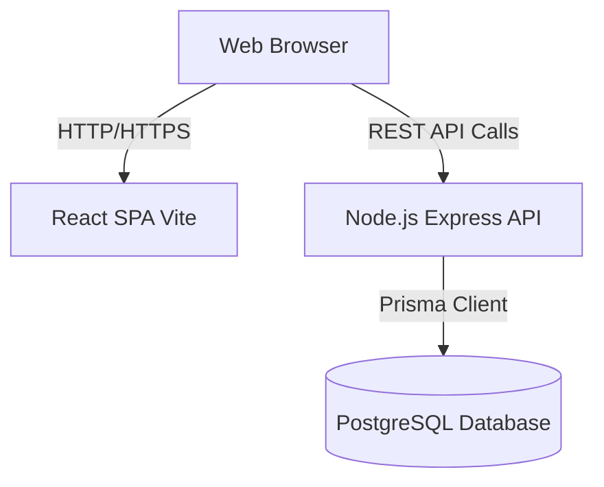

# System Architecture

## Overview
Ledger is structured as a full-stack monolithic repository encompassing a Node.js backend API and a React Single Page Application (SPA) frontend. It utilizes a PostgreSQL database.

## Architecture Diagram

## Data Flow
1. **Authentication:** The client sends credentials to `/api/auth/login`. Upon success, the server responds with a JWT, which the client uses for subsequent authenticated requests.
2. **Business Logic:** API routes interact with controllers, which validate input using Zod before invoking Prisma client methods to mutate or query data.
3. **Integrity:** PostgreSQL enforces relational constraints (e.g., customers cannot be deleted if they have associated challans).

## Key Technology Choices
- **React + Vite:** Chosen for fast HMR and optimized production builds.
- **Tailwind CSS:** Enables rapid, bespoke styling without the overhead of overriding component libraries.
- **Node.js + Express:** A robust and industry-standard backend framework for REST APIs.
- **Prisma:** Provides end-to-end type safety, making database migrations and queries predictable and less error-prone.
- **Zod:** Ensures runtime type safety for all incoming API payloads, preventing injection attacks and bad data.
